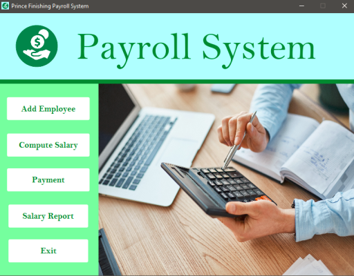

# Prince Finishing Payroll System

## Overview

This project is a Payroll Management System developed during my second year in Information Management. The system allows the management of employee payroll, including adding employees, computing salaries, processing payments, and generating salary reports. The application was built using Java, JavaFX, and MySQL.

### Technologies Used

- Java: The core programming language used for the application logic.
- JavaFX: Used for building the user interface.
- MySQL: Database management system for storing payroll data.
